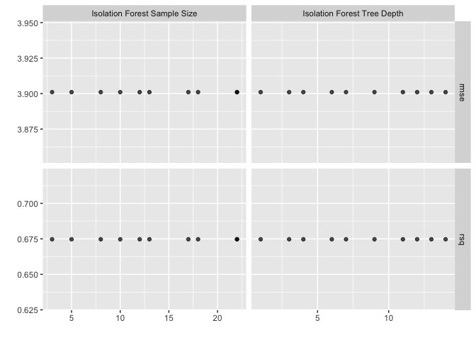

<!-- README.md is generated from README.Rmd. Please edit that file -->

# anomalyrecipes

<!-- badges: start -->
<!-- badges: end -->

Anomaly recipes provides `{recipes}` step functions for anomaly
detection.

Right now the package contains one step function: `step_isofor` (short
for isolation forest). This is an implementation of the isolation forest
algorithm from the R `{solitude}` package. The plan is to also add a
matrix profile step function from the `{tsmp}` package.

This is a work in progress (and mostly a pet project at this point), but
if you have a chance to try it out, please let me know how it goes.

## Installation

You can install the development version of anomalyrecipes from github:

``` r
devtools::install_github("kevin-m-kent/anomalyrecipes")
```

## Getting Started

Let’s start with a case where we are building some pre-processing steps
for a linear model. We would like to add a feature that captures how
anomalous observations are.

``` r
library(anomalyrecipes)
library(tidymodels)
library(tidyverse)
library(solitude)

tidymodels_prefer()

splits <- initial_split(mtcars)
train <- training(splits)
test <- testing(splits)
resamples <- bootstraps(train, times = 5)

rec_obj <- 
  recipe(mpg ~ ., data = mtcars) %>%
  step_dummy(all_nominal_predictors()) %>%
  step_isofor(all_predictors(), sample_size = 10, max_depth = 5)

baked_data <- rec_obj %>%
  prep() %>%
  bake(train)
#> INFO  [23:48:38.770] Building Isolation Forest ...  
#> INFO  [23:48:38.826] done 
#> INFO  [23:48:38.834] Computing depth of terminal nodes ...  
#> INFO  [23:48:39.202] done 
#> INFO  [23:48:39.211] Completed growing isolation forest

baked_data %>%
  head()
#> # A tibble: 6 x 12
#>     cyl  disp    hp  drat    wt  qsec    vs    am  gear  carb   mpg if_score
#>   <dbl> <dbl> <dbl> <dbl> <dbl> <dbl> <dbl> <dbl> <dbl> <dbl> <dbl>    <dbl>
#> 1     8  318    150  2.76  3.52  16.9     0     0     3     2  15.5    0.499
#> 2     8  472    205  2.93  5.25  18.0     0     0     3     4  10.4    0.566
#> 3     4  121    109  4.11  2.78  18.6     1     1     4     2  21.4    0.502
#> 4     4  120.    97  3.7   2.46  20.0     1     0     3     1  21.5    0.522
#> 5     8  301    335  3.54  3.57  14.6     0     1     5     8  15      0.550
#> 6     8  304    150  3.15  3.44  17.3     0     0     3     2  15.2    0.472
```

You can also tune the isolation forest pre-processing step:

``` r
lm_mod <- linear_reg() %>%
  set_engine("lm") 

rec_obj_tuned <- 
  recipe(mpg ~ ., data = mtcars) %>%
  step_dummy(all_nominal_predictors()) %>%
  step_isofor(all_predictors(), sample_size = tune(), max_depth = tune())

wf_linear <- workflow() %>%
  add_recipe(rec_obj_tuned) %>%
  add_model(lm_mod)

iso_param <- wf_linear %>%
  parameters() %>%
  update(sample_size = anomalyrecipes::sample_size(c(1, 24)))

tuned_results <- wf_linear %>%
  tune_grid(resamples = resamples, param_info = iso_param)
#> INFO  [23:48:39.733] dataset has duplicated rows 
#> INFO  [23:48:39.735] Building Isolation Forest ...  
#> INFO  [23:48:39.746] done 
#> INFO  [23:48:39.747] Computing depth of terminal nodes ...  
#> INFO  [23:48:39.971] done 
#> INFO  [23:48:39.978] Completed growing isolation forest 
#> INFO  [23:48:40.397] dataset has duplicated rows 
#> INFO  [23:48:40.398] Building Isolation Forest ...  
#> INFO  [23:48:40.407] done 
#> INFO  [23:48:40.408] Computing depth of terminal nodes ...  
#> INFO  [23:48:40.636] done 
#> INFO  [23:48:40.642] Completed growing isolation forest 
#> INFO  [23:48:41.035] dataset has duplicated rows 
#> INFO  [23:48:41.036] Building Isolation Forest ...  
#> INFO  [23:48:41.041] done 
#> INFO  [23:48:41.042] Computing depth of terminal nodes ...  
#> INFO  [23:48:41.259] done 
#> INFO  [23:48:41.264] Completed growing isolation forest 
#> INFO  [23:48:41.657] dataset has duplicated rows 
#> INFO  [23:48:41.658] Building Isolation Forest ...  
#> INFO  [23:48:41.664] done 
#> INFO  [23:48:41.664] Computing depth of terminal nodes ...  
#> INFO  [23:48:41.888] done 
#> INFO  [23:48:41.892] Completed growing isolation forest 
#> INFO  [23:48:42.271] dataset has duplicated rows 
#> INFO  [23:48:42.272] Building Isolation Forest ...  
#> INFO  [23:48:42.283] done 
#> INFO  [23:48:42.284] Computing depth of terminal nodes ...  
#> INFO  [23:48:42.497] done 
#> INFO  [23:48:42.502] Completed growing isolation forest 
#> INFO  [23:48:42.897] dataset has duplicated rows 
#> INFO  [23:48:42.898] Building Isolation Forest ...  
#> INFO  [23:48:42.908] done 
#> INFO  [23:48:42.909] Computing depth of terminal nodes ...  
#> INFO  [23:48:43.131] done 
#> INFO  [23:48:43.136] Completed growing isolation forest 
#> INFO  [23:48:43.522] dataset has duplicated rows 
#> INFO  [23:48:43.523] Building Isolation Forest ...  
#> INFO  [23:48:43.530] done 
#> INFO  [23:48:43.531] Computing depth of terminal nodes ...  
#> INFO  [23:48:43.746] done 
#> INFO  [23:48:43.751] Completed growing isolation forest 
#> INFO  [23:48:44.133] dataset has duplicated rows 
#> INFO  [23:48:44.134] Building Isolation Forest ...  
#> INFO  [23:48:44.143] done 
#> INFO  [23:48:44.144] Computing depth of terminal nodes ...  
#> INFO  [23:48:44.363] done 
#> INFO  [23:48:44.368] Completed growing isolation forest 
#> INFO  [23:48:44.756] dataset has duplicated rows 
#> INFO  [23:48:44.757] Building Isolation Forest ...  
#> INFO  [23:48:44.761] done 
#> INFO  [23:48:44.762] Computing depth of terminal nodes ...  
#> INFO  [23:48:44.983] done 
#> INFO  [23:48:44.989] Completed growing isolation forest 
#> INFO  [23:48:45.380] dataset has duplicated rows 
#> INFO  [23:48:45.381] Building Isolation Forest ...  
#> INFO  [23:48:45.388] done 
#> INFO  [23:48:45.389] Computing depth of terminal nodes ...  
#> INFO  [23:48:45.615] done 
#> INFO  [23:48:45.622] Completed growing isolation forest 
#> INFO  [23:48:46.094] dataset has duplicated rows 
#> INFO  [23:48:46.095] Building Isolation Forest ...  
#> INFO  [23:48:46.106] done 
#> INFO  [23:48:46.106] Computing depth of terminal nodes ...  
#> INFO  [23:48:46.328] done 
#> INFO  [23:48:46.333] Completed growing isolation forest 
#> INFO  [23:48:46.730] dataset has duplicated rows 
#> INFO  [23:48:46.731] Building Isolation Forest ...  
#> INFO  [23:48:46.739] done 
#> INFO  [23:48:46.740] Computing depth of terminal nodes ...  
#> INFO  [23:48:46.972] done 
#> INFO  [23:48:46.977] Completed growing isolation forest 
#> INFO  [23:48:47.368] dataset has duplicated rows 
#> INFO  [23:48:47.370] Building Isolation Forest ...  
#> INFO  [23:48:47.375] done 
#> INFO  [23:48:47.375] Computing depth of terminal nodes ...  
#> INFO  [23:48:47.594] done 
#> INFO  [23:48:47.599] Completed growing isolation forest 
#> INFO  [23:48:47.994] dataset has duplicated rows 
#> INFO  [23:48:47.995] Building Isolation Forest ...  
#> INFO  [23:48:48.000] done 
#> INFO  [23:48:48.001] Computing depth of terminal nodes ...  
#> INFO  [23:48:48.217] done 
#> INFO  [23:48:48.223] Completed growing isolation forest 
#> INFO  [23:48:48.606] dataset has duplicated rows 
#> INFO  [23:48:48.607] Building Isolation Forest ...  
#> INFO  [23:48:48.617] done 
#> INFO  [23:48:48.618] Computing depth of terminal nodes ...  
#> INFO  [23:48:48.833] done 
#> INFO  [23:48:48.839] Completed growing isolation forest 
#> INFO  [23:48:49.220] dataset has duplicated rows 
#> INFO  [23:48:49.222] Building Isolation Forest ...  
#> INFO  [23:48:49.230] done 
#> INFO  [23:48:49.231] Computing depth of terminal nodes ...  
#> INFO  [23:48:49.449] done 
#> INFO  [23:48:49.455] Completed growing isolation forest 
#> INFO  [23:48:49.831] dataset has duplicated rows 
#> INFO  [23:48:49.832] Building Isolation Forest ...  
#> INFO  [23:48:49.839] done 
#> INFO  [23:48:49.840] Computing depth of terminal nodes ...  
#> INFO  [23:48:50.058] done 
#> INFO  [23:48:50.063] Completed growing isolation forest 
#> INFO  [23:48:50.461] dataset has duplicated rows 
#> INFO  [23:48:50.462] Building Isolation Forest ...  
#> INFO  [23:48:50.469] done 
#> INFO  [23:48:50.471] Computing depth of terminal nodes ...  
#> INFO  [23:48:50.700] done 
#> INFO  [23:48:50.706] Completed growing isolation forest 
#> INFO  [23:48:51.100] dataset has duplicated rows 
#> INFO  [23:48:51.101] Building Isolation Forest ...  
#> INFO  [23:48:51.105] done 
#> INFO  [23:48:51.106] Computing depth of terminal nodes ...  
#> INFO  [23:48:51.327] done 
#> INFO  [23:48:51.332] Completed growing isolation forest 
#> INFO  [23:48:51.724] dataset has duplicated rows 
#> INFO  [23:48:51.726] Building Isolation Forest ...  
#> INFO  [23:48:51.731] done 
#> INFO  [23:48:51.732] Computing depth of terminal nodes ...  
#> INFO  [23:48:51.952] done 
#> INFO  [23:48:51.959] Completed growing isolation forest 
#> INFO  [23:48:52.413] dataset has duplicated rows 
#> INFO  [23:48:52.414] Building Isolation Forest ...  
#> INFO  [23:48:52.425] done 
#> INFO  [23:48:52.426] Computing depth of terminal nodes ...  
#> INFO  [23:48:52.663] done 
#> INFO  [23:48:52.669] Completed growing isolation forest 
#> INFO  [23:48:53.066] dataset has duplicated rows 
#> INFO  [23:48:53.067] Building Isolation Forest ...  
#> INFO  [23:48:53.076] done 
#> INFO  [23:48:53.077] Computing depth of terminal nodes ...  
#> INFO  [23:48:53.291] done 
#> INFO  [23:48:53.296] Completed growing isolation forest 
#> INFO  [23:48:53.682] dataset has duplicated rows 
#> INFO  [23:48:53.684] Building Isolation Forest ...  
#> INFO  [23:48:53.689] done 
#> INFO  [23:48:53.690] Computing depth of terminal nodes ...  
#> INFO  [23:48:53.908] done 
#> INFO  [23:48:53.914] Completed growing isolation forest 
#> INFO  [23:48:54.290] dataset has duplicated rows 
#> INFO  [23:48:54.291] Building Isolation Forest ...  
#> INFO  [23:48:54.296] done 
#> INFO  [23:48:54.297] Computing depth of terminal nodes ...  
#> INFO  [23:48:54.528] done 
#> INFO  [23:48:54.532] Completed growing isolation forest 
#> INFO  [23:48:54.929] dataset has duplicated rows 
#> INFO  [23:48:54.930] Building Isolation Forest ...  
#> INFO  [23:48:54.942] done 
#> INFO  [23:48:54.943] Computing depth of terminal nodes ...  
#> INFO  [23:48:55.169] done 
#> INFO  [23:48:55.176] Completed growing isolation forest 
#> INFO  [23:48:55.568] dataset has duplicated rows 
#> INFO  [23:48:55.569] Building Isolation Forest ...  
#> INFO  [23:48:55.580] done 
#> INFO  [23:48:55.581] Computing depth of terminal nodes ...  
#> INFO  [23:48:55.795] done 
#> INFO  [23:48:55.800] Completed growing isolation forest 
#> INFO  [23:48:56.194] dataset has duplicated rows 
#> INFO  [23:48:56.195] Building Isolation Forest ...  
#> INFO  [23:48:56.203] done 
#> INFO  [23:48:56.204] Computing depth of terminal nodes ...  
#> INFO  [23:48:56.431] done 
#> INFO  [23:48:56.436] Completed growing isolation forest 
#> INFO  [23:48:56.822] dataset has duplicated rows 
#> INFO  [23:48:56.823] Building Isolation Forest ...  
#> INFO  [23:48:56.830] done 
#> INFO  [23:48:56.831] Computing depth of terminal nodes ...  
#> INFO  [23:48:57.048] done 
#> INFO  [23:48:57.053] Completed growing isolation forest 
#> INFO  [23:48:57.434] dataset has duplicated rows 
#> INFO  [23:48:57.436] Building Isolation Forest ...  
#> INFO  [23:48:57.441] done 
#> INFO  [23:48:57.442] Computing depth of terminal nodes ...  
#> INFO  [23:48:57.664] done 
#> INFO  [23:48:57.670] Completed growing isolation forest 
#> INFO  [23:48:58.057] dataset has duplicated rows 
#> INFO  [23:48:58.058] Building Isolation Forest ...  
#> INFO  [23:48:58.064] done 
#> INFO  [23:48:58.065] Computing depth of terminal nodes ...  
#> INFO  [23:48:58.288] done 
#> INFO  [23:48:58.295] Completed growing isolation forest 
#> INFO  [23:48:58.762] dataset has duplicated rows 
#> INFO  [23:48:58.763] Building Isolation Forest ...  
#> INFO  [23:48:58.774] done 
#> INFO  [23:48:58.775] Computing depth of terminal nodes ...  
#> INFO  [23:48:58.998] done 
#> INFO  [23:48:59.004] Completed growing isolation forest 
#> INFO  [23:48:59.395] dataset has duplicated rows 
#> INFO  [23:48:59.396] Building Isolation Forest ...  
#> INFO  [23:48:59.405] done 
#> INFO  [23:48:59.406] Computing depth of terminal nodes ...  
#> INFO  [23:48:59.643] done 
#> INFO  [23:48:59.648] Completed growing isolation forest 
#> INFO  [23:49:00.045] dataset has duplicated rows 
#> INFO  [23:49:00.046] Building Isolation Forest ...  
#> INFO  [23:49:00.051] done 
#> INFO  [23:49:00.051] Computing depth of terminal nodes ...  
#> INFO  [23:49:00.272] done 
#> INFO  [23:49:00.278] Completed growing isolation forest 
#> INFO  [23:49:00.674] dataset has duplicated rows 
#> INFO  [23:49:00.675] Building Isolation Forest ...  
#> INFO  [23:49:00.681] done 
#> INFO  [23:49:00.682] Computing depth of terminal nodes ...  
#> INFO  [23:49:00.896] done 
#> INFO  [23:49:00.901] Completed growing isolation forest 
#> INFO  [23:49:01.297] dataset has duplicated rows 
#> INFO  [23:49:01.298] Building Isolation Forest ...  
#> INFO  [23:49:01.308] done 
#> INFO  [23:49:01.310] Computing depth of terminal nodes ...  
#> INFO  [23:49:01.525] done 
#> INFO  [23:49:01.530] Completed growing isolation forest 
#> INFO  [23:49:01.921] dataset has duplicated rows 
#> INFO  [23:49:01.922] Building Isolation Forest ...  
#> INFO  [23:49:01.931] done 
#> INFO  [23:49:01.932] Computing depth of terminal nodes ...  
#> INFO  [23:49:02.159] done 
#> INFO  [23:49:02.164] Completed growing isolation forest 
#> INFO  [23:49:02.556] dataset has duplicated rows 
#> INFO  [23:49:02.557] Building Isolation Forest ...  
#> INFO  [23:49:02.564] done 
#> INFO  [23:49:02.565] Computing depth of terminal nodes ...  
#> INFO  [23:49:02.796] done 
#> INFO  [23:49:02.801] Completed growing isolation forest 
#> INFO  [23:49:03.193] dataset has duplicated rows 
#> INFO  [23:49:03.194] Building Isolation Forest ...  
#> INFO  [23:49:03.201] done 
#> INFO  [23:49:03.202] Computing depth of terminal nodes ...  
#> INFO  [23:49:03.422] done 
#> INFO  [23:49:03.427] Completed growing isolation forest 
#> INFO  [23:49:03.818] dataset has duplicated rows 
#> INFO  [23:49:03.819] Building Isolation Forest ...  
#> INFO  [23:49:03.824] done 
#> INFO  [23:49:03.825] Computing depth of terminal nodes ...  
#> INFO  [23:49:04.044] done 
#> INFO  [23:49:04.049] Completed growing isolation forest 
#> INFO  [23:49:04.436] dataset has duplicated rows 
#> INFO  [23:49:04.437] Building Isolation Forest ...  
#> INFO  [23:49:04.444] done 
#> INFO  [23:49:04.445] Computing depth of terminal nodes ...  
#> INFO  [23:49:04.674] done 
#> INFO  [23:49:04.680] Completed growing isolation forest 
#> INFO  [23:49:05.134] dataset has duplicated rows 
#> INFO  [23:49:05.135] Building Isolation Forest ...  
#> INFO  [23:49:05.147] done 
#> INFO  [23:49:05.148] Computing depth of terminal nodes ...  
#> INFO  [23:49:05.533] done 
#> INFO  [23:49:05.540] Completed growing isolation forest 
#> INFO  [23:49:05.923] dataset has duplicated rows 
#> INFO  [23:49:05.924] Building Isolation Forest ...  
#> INFO  [23:49:05.932] done 
#> INFO  [23:49:05.933] Computing depth of terminal nodes ...  
#> INFO  [23:49:06.157] done 
#> INFO  [23:49:06.163] Completed growing isolation forest 
#> INFO  [23:49:06.539] dataset has duplicated rows 
#> INFO  [23:49:06.540] Building Isolation Forest ...  
#> INFO  [23:49:06.546] done 
#> INFO  [23:49:06.547] Computing depth of terminal nodes ...  
#> INFO  [23:49:06.760] done 
#> INFO  [23:49:06.765] Completed growing isolation forest 
#> INFO  [23:49:07.146] dataset has duplicated rows 
#> INFO  [23:49:07.147] Building Isolation Forest ...  
#> INFO  [23:49:07.153] done 
#> INFO  [23:49:07.154] Computing depth of terminal nodes ...  
#> INFO  [23:49:07.381] done 
#> INFO  [23:49:07.386] Completed growing isolation forest 
#> INFO  [23:49:07.770] dataset has duplicated rows 
#> INFO  [23:49:07.772] Building Isolation Forest ...  
#> INFO  [23:49:07.784] done 
#> INFO  [23:49:07.785] Computing depth of terminal nodes ...  
#> INFO  [23:49:08.007] done 
#> INFO  [23:49:08.013] Completed growing isolation forest 
#> INFO  [23:49:08.401] dataset has duplicated rows 
#> INFO  [23:49:08.402] Building Isolation Forest ...  
#> INFO  [23:49:08.412] done 
#> INFO  [23:49:08.413] Computing depth of terminal nodes ...  
#> INFO  [23:49:08.636] done 
#> INFO  [23:49:08.644] Completed growing isolation forest 
#> INFO  [23:49:09.052] dataset has duplicated rows 
#> INFO  [23:49:09.054] Building Isolation Forest ...  
#> INFO  [23:49:09.062] done 
#> INFO  [23:49:09.063] Computing depth of terminal nodes ...  
#> INFO  [23:49:09.305] done 
#> INFO  [23:49:09.310] Completed growing isolation forest 
#> INFO  [23:49:09.742] dataset has duplicated rows 
#> INFO  [23:49:09.744] Building Isolation Forest ...  
#> INFO  [23:49:09.751] done 
#> INFO  [23:49:09.752] Computing depth of terminal nodes ...  
#> INFO  [23:49:09.977] done 
#> INFO  [23:49:09.982] Completed growing isolation forest 
#> INFO  [23:49:10.376] dataset has duplicated rows 
#> INFO  [23:49:10.378] Building Isolation Forest ...  
#> INFO  [23:49:10.382] done 
#> INFO  [23:49:10.383] Computing depth of terminal nodes ...  
#> INFO  [23:49:10.596] done 
#> INFO  [23:49:10.601] Completed growing isolation forest 
#> INFO  [23:49:10.982] dataset has duplicated rows 
#> INFO  [23:49:10.983] Building Isolation Forest ...  
#> INFO  [23:49:10.990] done 
#> INFO  [23:49:10.990] Computing depth of terminal nodes ...  
#> INFO  [23:49:11.213] done 
#> INFO  [23:49:11.218] Completed growing isolation forest

tuned_results %>%
  autoplot()
```


